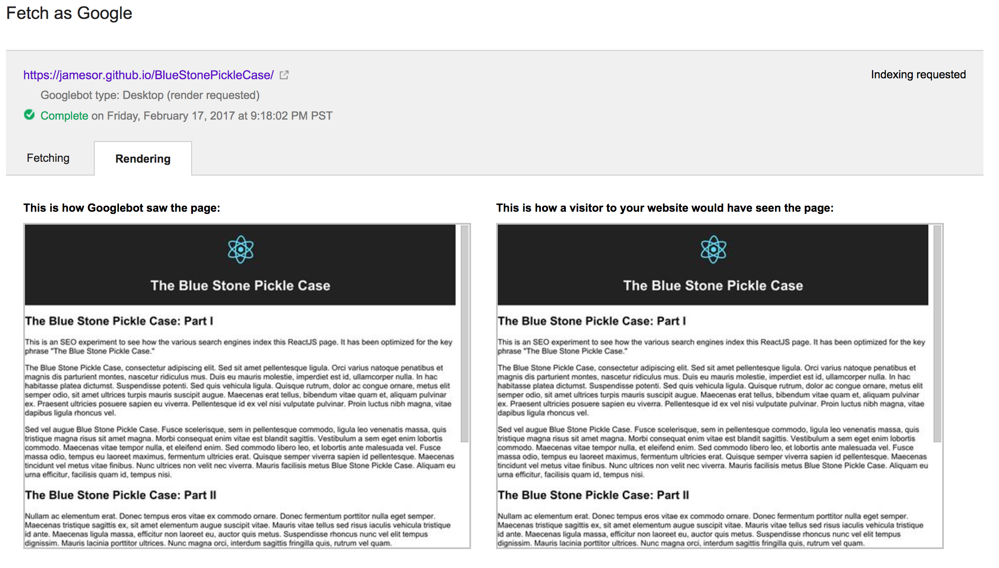

# Blue Stone Pickle Case

This is a simple ReactJS experiment to test how search engines like Google, Bing and Yahoo! index the content.

The concept is to bootstrap the state of the ReactJS app by setting state as a JSON object in the head, then using ReactJS to read that state at run-time. Google will wait for the page to execute JavaScript and ReactJS to render the UI before it indexes the page, as long as you don't use callbacks like Ajax calls or setTimeout.

## Reference
[SEO vs. React: Web Crawlers are Smarter Than You Think](https://medium.freecodecamp.com/seo-vs-react-is-it-neccessary-to-render-react-pages-in-the-backend-74ce5015c0c9#.ljkijw4lt)